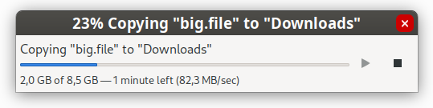
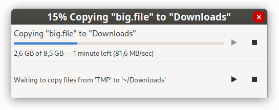
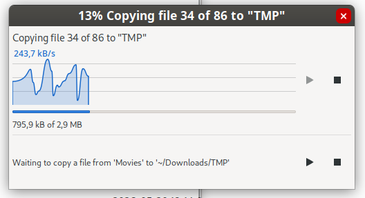
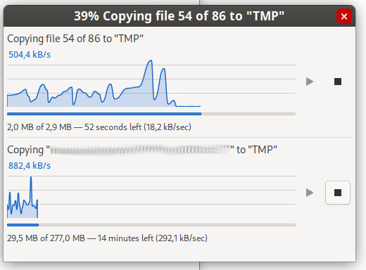
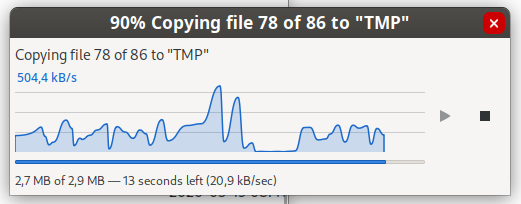

# Motivation & Screenshots

This directory contains the motivation for the proposed bandwidth graph enhancement and visual comparisons between Nemo's current file transfer dialog and the proposed design.

## Why this feature?

Nemo's current file operation dialog provides basic information during file transfers:

* Progress percentage
* Estimated time remaining
* File count

While this is sufficient for simple operations, it does not provide insight into actual transfer performance.

For larger transfers, users often want to know:

* Whether transfer speed is stable
* If throughput is limited by storage performance
* Whether network transfers are fluctuating
* How performance changes over time

A real-time bandwidth graph makes this information immediately visible without requiring external monitoring tools.

## Current Nemo Dialog

The default Nemo transfer dialog displays progress information but does not provide throughput history or performance visualization.

## Proposed Enhanced Dialog

The proposed design adds a real-time bandwidth graph and transfer speed visualization while preserving the existing workflow and overall layout.

## Design Goals

The enhancement is designed to:

* Improve visibility into transfer performance
* Remain lightweight and unobtrusive
* Preserve the familiar Nemo user experience
* Avoid modifications to transfer logic
* Provide useful feedback during long-running operations

## Notes

The screenshots in this directory are intended to demonstrate the concept and user experience of the feature.

