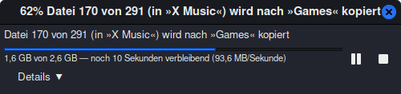
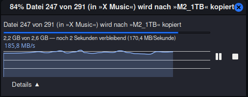
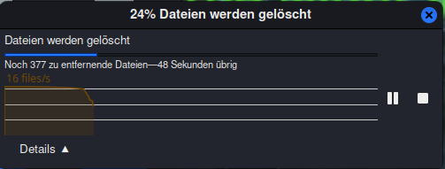

# Nemo Transfer Speed Graph Patch

A UI enhancement patch for **Nemo file manager** that adds a real-time **transfer speed / bandwidth graph** during file operations (copy, move, delete).

It upgrades the default progress dialog with live throughput visualization, similar to:

- Dolphin file manager (KDE)
- Windows File Explorer

## Credits

**Original author:** Mario Lohajner ([@mlohajner](https://github.com/mlohajner)) — [Original repository](https://github.com/mlohajner/nemo_progress_dialogue)

**Mint 22.3 port:** Daniel ([@cori77-hub](https://github.com/cori77-hub)) — This fork adapts the original patch (targeting Fedora Nemo 6.4.5) to **Linux Mint 22.3 / Nemo 6.6.3+zena**.

## Overview

Nemo's default file operation dialog shows only basic progress information:

- Progress percentage
- Estimated time remaining
- File count

This patch enhances it by adding a **real-time bandwidth graph**, making operation performance visible over time.

## Features

- Real-time transfer and delete speed monitoring (KB/s, MB/s, files/s)
- Live bandwidth graph over time
- Automatic graph scaling based on throughput
- Collapsible graph/details view (default: collapsed)
- Compact progress dialog layout
- Delete operations use an inverted accent color for instant visual distinction
- Works for copy, move and delete operations
- Minimal performance overhead

---

## Motivation

When working with large file transfers or deletions, the default UI hides useful performance information.

This patch improves visibility for:

- Large backups and archives
- External drives (USB, HDD, SSD)
- Network transfers (SMB, NFS)
- Large batch deletions

Instead of only showing *progress %,* users can now see **how fast the operation is actually performing and how it changes over time**.

## What this adds

Default (graph collapsed):
- Progress bar
- File count and operation status
- Real-time speed / time remaining



Expanded:
- All of the above, plus live bandwidth history graph



Delete mode:
- Delete / trash / empty-trash operations show speed in **files/sec** and use an inverted accent color on the graph.
- Very fast local deletions may finish before the graph becomes visible; the dialog still appears immediately so progress is shown.



## Compatibility

- **Nemo 6.6.3+zena** (Linux Mint 22.3, Ubuntu 24.04 base)
- While Nemo is typically used within Cinnamon, this patch only depends on Nemo and can run independently in other compatible environments.

## Patched Files

The following source files are modified:

| File | Change |
|------|--------|
| `libnemo-private/nemo-progress-info.h` | `set_speed()` / `get_speed()` / `set_delete_mode()` / `get_delete_mode()` declarations |
| `libnemo-private/nemo-progress-info.c` | `transfer_rate` + `nemo_delete` fields + getter/setter |
| `libnemo-private/nemo-file-operations.c` | `TransferInfo` extended + instant speed calculation + delete-mode flag for delete/trash/empty-trash |
| `src/nemo-progress-info-widget.h` | Graph data fields (`speed_graph`, `graph_data`, etc.) |
| `src/nemo-progress-info-widget.c` | `update_progress()`, `on_graph_draw()`, `constructed()`, collapsible details, inverted delete color |
| `src/nemo-progress-ui-handler.c` | Tighter progress window layout |

## Installation (Linux Mint 22.3)

### Prerequisites

```bash
# Enable source repositories
sudo cp /etc/apt/sources.list.d/official-package-repositories.list \
        /etc/apt/sources.list.d/official-package-repositories-src.list
sudo sed -i 's/^deb /deb-src /' /etc/apt/sources.list.d/official-package-repositories-src.list
sudo apt-get update

# Install build dependencies
sudo apt-get build-dep nemo
sudo apt-get install -y devscripts
```

### Build

```bash
# Get Nemo source
apt source nemo
cd nemo-6.6.3+zena

# Apply patches (see "Patched Files" above)
# ... apply each patch manually or copy from this repo ...

# Build
dpkg-buildpackage -us -uc -b
cd ..
```

### Install / Uninstall

Use the included management script:

```bash
# Install the patched packages (backs up originals first)
./manage-nemo-patch.sh install

# Restore original packages
./manage-nemo-patch.sh uninstall

# Check current status
./manage-nemo-patch.sh status
```

After installation, restart Nemo:

```bash
nemo -q && nemo
```

### Notes

- The graph is collapsed by default. Click **Details ▼** to expand it and **Details ▲** to collapse it again.
- Delete, trash and empty-trash operations show an inverted accent graph color so you can tell destructive operations apart at a glance.
- The update rate depends on how often GIO reports progress. With many small files, the graph updates near-continuously. With a single very large file, GIO may only report every 15–20 seconds — this is a GIO limitation, not a patch issue.
- Always create a Timeshift snapshot before replacing system packages.

## Notes

This patch only modifies the **UI layer of file operations**.

It does not change:
- file transfer logic
- backend I/O implementation
- delete/trash logic or confirmation behavior

## License

Same license as Nemo (GPL-2.0+).
